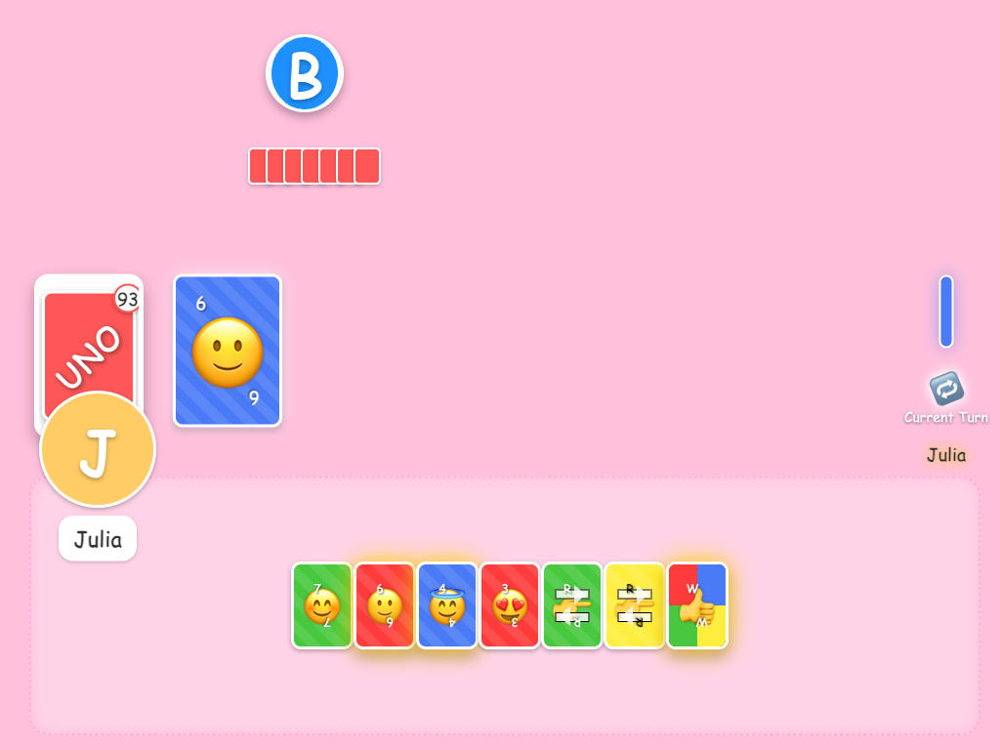

# Bluey Uno

A Bluey-themed Uno card game built for young children (specifically a 4-year-old) to play against Bluey cartoon characters!



## Features

- Play Uno against 1-3 Bluey characters (Bluey, Bingo, Dad/Bandit)
- Emoji-themed Uno cards with special 💩 for Wild Draw 4
- Child-friendly interface with large, colorful elements
- Complete Uno rules including special cards and "UNO!" calls
- Character sounds and animations
- Mobile/tablet-friendly design with touch controls
- Responsive layout for different screen sizes
- Card animations and visual feedback when cards are played
- Enhanced visual design with better card and UI elements

## How to Play

1. Start the game and select the number of players (2-4)
2. Match cards by color or number with the top card on the discard pile
3. Play special cards for effects (Skip, Reverse, Draw 2, etc.)
4. Say "UNO!" when you have only one card left
5. First player to get rid of all their cards wins!

## Game Rules

- Match cards by color or number
- Special cards:
  - Skip (🙅‍♀️): Next player misses their turn
  - Reverse (👉): Reverses direction of play
  - Draw 2 (👯‍♀️): Next player draws 2 cards and misses their turn
  - Wild (👍): Change the current color
  - Wild Draw 4 (💩): Next player draws 4 cards, misses their turn, and you change the color

- When you have only one card left, remember to click "Say UNO!"
- First player to get rid of all their cards wins!

## Installation & Setup

1. Clone the repository:
   ```
   git clone https://github.com/GregBaugues/bluey-uno.git
   cd bluey-uno
   ```

2. Install dependencies:
   ```
   npm install
   ```

3. Start the development server:
   ```
   npm start
   ```

4. Open your browser and navigate to:
   ```
   http://localhost:1234
   ```

## Project Architecture

The game is built with a modular architecture to maintain separation of concerns:

### Core Modules

1. **Deck System** (`deck.js`)
   - Creates and manages the Uno card deck
   - Handles shuffling, dealing, and card operations

2. **Game Logic** (`game.js`)
   - Manages the core game state and flow
   - Handles turn management and game flow
   - Processes card plays and special card effects
   - Contains AI logic for computer players

3. **Player System** (`players.js`, `playerManager.js`)
   - Manages player creation and state
   - Handles AI decision-making for computer players
   - Manages turn progression

4. **UI System** (`ui.js`)
   - Renders the game interface based on game state
   - Handles user interactions and animations
   - Updates display in response to game events
   - Manages animations and visual feedback

5. **Sound System** (`sounds.js`)
   - Uses Web Audio API for game sounds
   - Provides sound effects for different game events
   - Includes character voice sounds

6. **Character System** (`images.js`)
   - Manages character images and displays
   - Provides fallback with colored initials when images unavailable

### Utility Modules

- **Constants** (`constants.js`) - Game-wide constants and configurations
- **Game Rules** (`gameRules.js`) - Rules enforcement and validation
- **Game State** (`gameState.js`) - State management utilities
- **Turn Manager** (`turnManager.js`) - Manages player turns and direction
- **Events** (`events.js`) - Custom event handling
- **Utils** (`utils.js`) - General utility functions

## Repository Structure

- `/src/` - Source code files
- `/public/` - Public assets
  - `/public/images/` - Character and UI images
  - `/public/audio/` - Sound files
- `/screenshots/` - Game screenshots for documentation
- `/claude/` - Documentation files
  - `/claude/scratch/` - Development notes and planning documents
- `CLAUDE.md` - Technical documentation

## Development

### Technologies Used

- **HTML5** - Structure and content
- **CSS3** - Styling and animations
- **JavaScript** - Game logic and interactivity
- **Parcel** - Bundling and development server

### Code Quality

The project uses ESLint for code quality and consistency:

```bash
# Run linting (if configured)
npx eslint src/
```

**ESLint Configuration:**
- Unused imports detection
- Import/export validation
- Modern JavaScript standards enforcement

### Testing

The project uses Puppeteer for automated testing. Comprehensive testing documentation and examples can be found in `/claude/TESTING.md`. 

#### Available Test Commands

```bash
# Run specific wild draw four test
npm run test:wild-draw-four
```

#### Testing Approach

Key testing methodologies include:

- Screenshot-based testing for visual verification
- DOM interaction testing via click events
- Game state verification through automated gameplay
- Selector-based element targeting for UI interactions
- Visual comparison between different game states
- Automated testing of special card mechanics (Wild Draw 4, etc.)

### Recent Visual Enhancements

The latest version includes several visual and UX improvements:

1. **Card Animation and Feedback:**
   - Playful animations when cards are played
   - Visual effects for the discard pile
   - Celebratory effects for special cards

2. **Enhanced Player Turn Indication:**
   - More prominent turn indicators
   - Improved visual cues for the current player

3. **Card Design Enhancement:**
   - Larger, more colorful cards with rounded corners
   - Gradient colors and improved emoji visuals
   - Better hover and active states

4. **Welcome Screen Improvement:**
   - Enhanced visual design with animations
   - Improved button interactions

5. **Game Feedback Messages:**
   - Better visual indicators for playable cards
   - Enhanced UNO indicator with animations
   - Clearer feedback for game actions

### Adding Character Images

To add custom character images:

1. Place image files in the `/public/images/` directory
2. Update the references in `/src/constants.js`
3. Add preloading elements in `index.html` if needed

## License

This is a fan project created for educational purposes and personal use.
Bluey character rights belong to their respective owners.

## Acknowledgments

- Built with love for a 4-year-old Bluey fan
- Inspired by the classic Uno card game

Enjoy playing Uno with Bluey and friends!